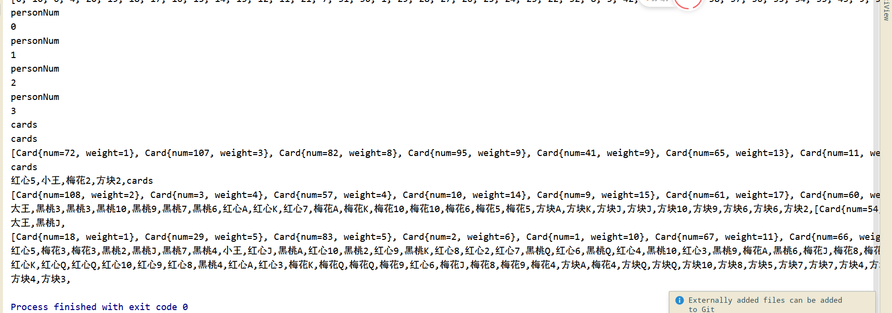

实验十一  实现一个红五的发牌程序

 

学号：       姓名：       班级：        

【实验目的和要求】

\1. 理解多线程技术；

\2. 了解红五游戏的规则。

\3. 了解敏捷开发过程

【实验内容】

实现一个红五的发牌程序

1）游戏由两副牌构成

2）4个玩家

3）系统能随机洗牌后模拟真实情况分别向4个玩家发牌，并剩下8张底牌

4）程序能符合人性的方式输出四个玩家手上的牌和底牌（按照人类合理的理牌顺序输出）*合理的理牌顺序是分花色，分大小归类排序，每次都按照打2，并且黑心是主牌进行整理主牌大小顺序：红心5，大王，小王，黑桃3，梅花3，黑桃2，其他2，A,K…5,4

红色副牌：A,K…..4,3 

梅花色副牌：A,K…..5,4

 

方色副牌：A,K…..5,4

 

 

输出结果截图：

 

 

 

实现代码：

 

```java
package lab11;


import java.util.*;

public class Redfive {

    void  pushKTo4(int row, List<Integer>  order){
//        for (int i = 12; i >=4 ; i--) {
        for (int i = 13; i >=4 ; i--) {
//            if(row*13+i==96){
//                System.out.println("find 96");
//            }
            int cardNum= row*13+i;
            if(cardNum==18){
                continue;
            }
//            order.add(row*13+i);
            order.add(cardNum);
        }
    }

    List<Integer>  orderPush(){
        List<Integer> order= new ArrayList<>();
        order.add(13*1+5); //红心5
        order.add(13*4 +2); //大王
        order.add(13*4 +1);
//        红心3, 是没有 设置order
        order.add(3); // 黑桃三
//        order.add(13*3+3); //梅花三
        order.add(13*2+3); //梅花三
        order.add(2 ); //黑桃2
        order.add(13*1+2 );  //其他2
        order.add(13*2+2 );
        order.add(13*3+2 );
//        没有3
        for(int i=0;i<4;i++){
            order.add(i*13+1);
//            1
//            push12To4(i,order);
            pushKTo4(i,order);
            if(i==1){
                order.add(i*13+3);
            }
        }
        order.add(42);
//        42 方块3 不存在
        return  order;
//
//        int[] order=new int[13*4+2+10];

    }

    int[] setWeight(  List<Integer> order){
        List<Card>cards=new ArrayList<>();
        int[] weights=new int[(13*4+2)*2+7];
//        weights 的idx 就是他的 牌的号码
//        order 里面的才是 weight 吧
//        for (int i = 1; i <=(13*4+2)*2 ; i++) {
//            weights[i]=i;
//            cards.add(new Card(i,i));
//        }
//        order 第一个 就是 权重 1的
//        System.out.println("order");
//        System.out.println(order);
        int weight=1;
        for (Integer num : order) {
//            num 是牌的 num
//            weights[num]=weight++;
//            System.out.println("weight");
//            System.out.println(weight);

//            if(weight==1){
//                System.out.println("num");
//                System.out.println(num);
//                System.out.println("num+13*4+2");
//                System.out.println(num+13*4+2);
//            }
//            if(num==18){
//                System.out.println("num==18");
//                System.out.println("weight");
//                System.out.println(weight);
//            }

            weights[num]=weight;
            weights[num+13*4+2]=weight;
//            1+54
//            System.out.println("num+13*4+2");
//            System.out.println(num+13*4+2);
//            不存在 42 吗
//            3*13+ 3
            if(num+13*4+2==96){
                System.out.println("find 96");
            }
//            cards.add(new Card(num,weight));
////            两副牌
//            cards.add(new Card(num+13*4+2,weight));
            weight++;
        }
        System.out.println("weights[18]");
        System.out.println(weights[18]);
        System.out.println("weights");
        System.out.println(Arrays.toString(weights));
        return weights;

    }

//    List<Card> setWeight(  List<Integer> order){
//        List<Card>cards=new ArrayList<>();
//        int[] weights=new int[(13*4+2)*2+7];
////        weights 的idx 就是他的 牌的号码
////        order 里面的才是 weight 吧
////        for (int i = 1; i <=(13*4+2)*2 ; i++) {
////            weights[i]=i;
////            cards.add(new Card(i,i));
////        }
////        order 第一个 就是 权重 1的
//        int weight=1;
//        for (Integer num : order) {
////            num 是牌的 num
////            weights[num]=weight++;
//            weights[num]=weight;
//            cards.add(new Card(num,weight));
////            两副牌
//            cards.add(new Card(num+13*4+2,weight));
//            weight++;
//        }
//        return cards;
//
//    }

    String []color={"黑桃","红心","梅花","方块"};
//    List<Card>cards,
//List<Integer> order,
  public static   List<Card> printCards(   int[] weights, Integer[] person){
        List<Card>cards=new ArrayList<>();
//        int[] person;
//        List<Card>cards=new ArrayList<>();
//        int[] weights=new int[(13*4+2)*2+7];
//        weights 的idx 就是他的 牌的号码
//        for (Card card : cards) {
//
//        }
//        System.out.println("weights");
//        System.out.println(Arrays.toString(weights));
        for (int cardNum : person) {
            cards.add(new Card(cardNum,weights[cardNum]));
//            weights[cardNum];
        }
//        System.out.println("cards");
//        System.out.println(cards);
        cards.sort((o1,o2)->{
            return o1.weight-o2.weight;
        });
//        13*2==26

        System.out.println("cards");
        System.out.println(cards);

        for (Card card : cards) {
            System.out.print(card.getName()+",");
        }
//        Card{num=53, weight=3},
        System.out.println();
//        order 里面的才是 weight 吧
//        for (int i = 1; i <=(13*4+2)*2 ; i++) {
//            weights[i]=i;
//            cards.add(new Card(i,i));
//        }
//        order 第一个 就是 权重 1的
//        int weight=1;
//        for (Integer num : order) {
////            num 是牌的 num
////            weights[num]=weight++;
//            cards.add(new Card(num,weight));
////            两副牌
//            cards.add(new Card(num+13*4+2,weight));
//        }
        return cards;

    }


    boolean [] getOneCard(int i,int j, Integer[][] persons,
                    ArrayList<Integer> cards,boolean []taken){

        while (true){
            int index = (int) (Math.random() * (cards.size()));
            if(!taken[index]){
                taken[index]=true;
                persons[i][j] = cards.get(index);
                break;
            }

        }
        return taken;

    }

    Integer[][]  genCards(){
        ArrayList<Integer> cards = new ArrayList<>(108);
        boolean []taken=new boolean[108+8];
        for (int i = 1; i <= 108; i++) {
            cards.add(i);
            taken[i]=false;
        }
//        为什么要多线程 发牌不是一个一个发吗
        Integer[][] persons = new Integer[4][25];
        for (int i = 0; i < 4; i++) {
            for (int j = 0; j < 25; j++) {
//                1... 13
//                13*4+2
//                52+2  54
//                108 ... 100
//                100==4*25
//                3）系统能随机洗牌后模拟真实情况分别向4个玩家发牌，并剩下8张底牌
//                boolean[] taken = getOneCard(i, j, persons, cards, taken);
                taken=   getOneCard(i, j, persons, cards, taken);
//                int index = (int) (Math.random() * (cards.size()));
////                但是随机会随机到已经拿过的吧 而且size 不断在变小？
//                persons[i][j] = cards.get(index);
//                cards.remove(index);
            }
        }
        return persons;
    }


    public static void main(String[] args) {
//        Card{num=53, weight=3},
//        System.out.println("53/13");
//        System.out.println(53/13);
//        System.out.println("53%13");
//        System.out.println(53%13);
//        53/13
//        4
//        53%13
//        1
//        是 A 啊

//        System.out.println("61/13");
//        System.out.println(61/13);
//        System.out.println("61%13");
//        System.out.println(61%13);
//        61/13
//        4
//        61%13
//        9

//        文档：我的牌是梅花3 ,方块A ,红心K ,红心10 ...
//        链接：http://note.youdao.com/noteshare?id=431dbe6addb635c0dce6416d07b85677&sub=E4021010A5DA4E3D8D16C67575182CDE
        Redfive redfive = new Redfive();
        Integer[][] persons = redfive.genCards();
        List<Integer> order = redfive.orderPush();
//        System.out.println("order");
//        System.out.println(order);
        int[] weights = redfive.setWeight(order);
//        System.out.println("weights");
//        System.out.println(Arrays.toString(weights));
        int personIdx=0;
        for (Integer[] person : persons) {
//            System.out.println("person"+personIdx);
//            List<Card> cards = redfive.printCards(weights, person);

//            List<Card> cards = Redfive.printCards(weights, person);
//            System.out.println(cards);
//            线程的话 他必然是 混乱的输出啊
            Shower shower = new Shower();
            shower.setPerson(person);
            shower.setWeights(weights);
            shower.setPersonNum(personIdx);
//            shower.r
//            shower.run();
            new Thread(shower).start();
//            https://www.cnblogs.com/202116xi/p/14478960.html
            personIdx++;
//            List<Card> cards =
//                    System.out.println(cards);
        }


    }


}

```

 

```java
package lab11;

import java.util.Arrays;
import java.util.Comparator;

public class Shower implements Runnable {
    Integer person[];
//两副牌
//    https://jingyan.baidu.com/article/425e69e69ee6f8be14fc1660.html
    @Override
    public void run() {

        System.out.println("personNum");
        System.out.println(personNum);
        Redfive.printCards(weights, person);


    }

    int []weights;

    public Integer[] getPerson() {
        return person;
    }

    public void setPerson(Integer[] person) {
        this.person = person;
    }

    public int[] getWeights() {
        return weights;
    }

    public void setWeights(int[] weights) {
        this.weights = weights;
    }

    public Shower(Integer[] p) {
        this.person = p;
    }

    public Shower() {
    }

    int personNum;

    public int getPersonNum() {
        return personNum;
    }

    public void setPersonNum(int personNum) {
        this.personNum = personNum;
    }
}

```

person0
cards
[Card{num=83, weight=5}, Card{num=1, weight=10}, Card{num=67, weight=11}, Card{num=13, weight=11}, Card{num=59, weight=19}, Card{num=26, weight=22}, Card{num=25, weight=23}, Card{num=78, weight=24}, Card{num=77, weight=25}, Card{num=23, weight=25}, Card{num=75, weight=27}, Card{num=27, weight=32}, Card{num=39, weight=33}, Card{num=36, weight=36}, Card{num=35, weight=37}, Card{num=88, weight=38}, Card{num=34, weight=38}, Card{num=33, weight=39}, Card{num=87, weight=39}, Card{num=86, weight=40}, Card{num=85, weight=41}, Card{num=94, weight=43}, Card{num=44, weight=52}, Card{num=98, weight=52}, Card{num=42, weight=54}]
梅花3,黑桃A,黑桃K,黑桃K,黑桃5,红心K,红心Q,红心J,红心10,红心10,红心8,梅花A,梅花K,梅花10,梅花9,梅花8,梅花8,梅花7,梅花7,梅花6,梅花5,方块A,方块5,方块5,方块3,
person1
cards
[Card{num=18, weight=1}, Card{num=108, weight=2}, Card{num=29, weight=5}, Card{num=56, weight=6}, Card{num=15, weight=7}, Card{num=69, weight=7}, Card{num=82, weight=8}, Card{num=12, weight=12}, Card{num=65, weight=13}, Card{num=10, weight=14}, Card{num=4, weight=20}, Card{num=79, weight=23}, Card{num=22, weight=26}, Card{num=21, weight=27}, Card{num=74, weight=28}, Card{num=20, weight=28}, Card{num=19, weight=29}, Card{num=93, weight=33}, Card{num=38, weight=34}, Card{num=37, weight=35}, Card{num=84, weight=42}, Card{num=51, weight=45}, Card{num=104, weight=46}, Card{num=48, weight=48}, Card{num=96, weight=54}]
红心5,大王,梅花3,黑桃2,红心2,红心2,梅花2,黑桃Q,黑桃J,黑桃10,黑桃4,红心Q,红心9,红心8,红心7,红心7,红心6,梅花K,梅花Q,梅花J,梅花4,方块Q,方块J,方块9,方块3,
person2
cards
[Card{num=3, weight=4}, Card{num=57, weight=4}, Card{num=28, weight=8}, Card{num=95, weight=9}, Card{num=55, weight=10}, Card{num=66, weight=12}, Card{num=11, weight=13}, Card{num=64, weight=14}, Card{num=63, weight=15}, Card{num=61, weight=17}, Card{num=5, weight=19}, Card{num=80, weight=22}, Card{num=24, weight=24}, Card{num=76, weight=26}, Card{num=70, weight=31}, Card{num=90, weight=36}, Card{num=89, weight=37}, Card{num=32, weight=40}, Card{num=30, weight=42}, Card{num=40, weight=43}, Card{num=52, weight=44}, Card{num=49, weight=47}, Card{num=46, weight=50}, Card{num=100, weight=50}, Card{num=43, weight=53}]
黑桃3,黑桃3,梅花2,方块2,黑桃A,黑桃Q,黑桃J,黑桃10,黑桃9,黑桃7,黑桃5,红心K,红心J,红心9,红心3,梅花10,梅花9,梅花6,梅花4,方块A,方块K,方块10,方块7,方块7,方块4,
person3
cards
[Card{num=72, weight=1}, Card{num=54, weight=2}, Card{num=107, weight=3}, Card{num=53, weight=3}, Card{num=2, weight=6}, Card{num=9, weight=15}, Card{num=62, weight=16}, Card{num=8, weight=16}, Card{num=60, weight=18}, Card{num=58, weight=20}, Card{num=68, weight=21}, Card{num=73, weight=29}, Card{num=71, weight=30}, Card{num=17, weight=30}, Card{num=81, weight=32}, Card{num=92, weight=34}, Card{num=31, weight=41}, Card{num=106, weight=44}, Card{num=103, weight=47}, Card{num=102, weight=48}, Card{num=47, weight=49}, Card{num=101, weight=49}, Card{num=45, weight=51}, Card{num=99, weight=51}, Card{num=97, weight=53}]
红心5,大王,小王,小王,黑桃2,黑桃9,黑桃8,黑桃8,黑桃6,黑桃4,红心A,红心6,红心4,红心4,梅花A,梅花Q,梅花5,方块K,方块10,方块9,方块8,方块8,方块6,方块6,方块4,


personNum
0
personNum
1
personNum
2
personNum
3
cards
cards
[Card{num=72, weight=1}, Card{num=107, weight=3}, Card{num=82, weight=8}, Card{num=95, weight=9}, Card{num=41, weight=9}, Card{num=65, weight=13}, Card{num=11, weight=13}, Card{num=7, weight=17}, Card{num=4, weight=20}, Card{num=78, weight=24}, Card{num=23, weight=25}, Card{num=22, weight=26}, Card{num=21, weight=27}, Card{num=74, weight=28}, Card{num=73, weight=29}, Card{num=17, weight=30}, Card{num=70, weight=31}, Card{num=81, weight=32}, Card{num=91, weight=35}, Card{num=88, weight=38}, Card{num=33, weight=39}, Card{num=32, weight=40}, Card{num=52, weight=44}, Card{num=48, weight=48}, Card{num=101, weight=49}]
cards
红心5,小王,梅花2,方块2,cards
[Card{num=108, weight=2}, Card{num=3, weight=4}, Card{num=57, weight=4}, Card{num=10, weight=14}, Card{num=9, weight=15}, Card{num=61, weight=17}, Card{num=60, weight=18}, Card{num=68, weight=21}, Card{num=80, weight=22}, Card{num=20, weight=28}, Card{num=27, weight=32}, Card{num=93, weight=33}, Card{num=36, weight=36}, Card{num=90, weight=36}, Card{num=86, weight=40}, Card{num=31, weight=41}, Card{num=85, weight=41}, Card{num=40, weight=43}, Card{num=106, weight=44}, Card{num=104, weight=46}, Card{num=50, weight=46}, Card{num=103, weight=47}, Card{num=102, weight=48}, Card{num=45, weight=51}, Card{num=99, weight=51}]
大王,黑桃3,黑桃3,黑桃10,黑桃9,黑桃7,黑桃6,红心A,红心K,红心7,梅花A,梅花K,梅花10,梅花10,梅花6,梅花5,梅花5,方块A,方块K,方块J,方块J,方块10,方块9,方块6,方块6,方块2,[Card{num=54, weight=2}, Card{num=53, weight=3}, Card{num=56, weight=6}, Card{num=69, weight=7}, Card{num=12, weight=12}, Card{num=63, weight=15}, Card{num=62, weight=16}, Card{num=59, weight=19}, Card{num=58, weight=20}, Card{num=14, weight=21}, Card{num=16, weight=31}, Card{num=39, weight=33}, Card{num=92, weight=34}, Card{num=38, weight=34}, Card{num=89, weight=37}, Card{num=34, weight=38}, Card{num=84, weight=42}, Card{num=30, weight=42}, Card{num=51, weight=45}, Card{num=47, weight=49}, Card{num=46, weight=50}, Card{num=100, weight=50}, Card{num=44, weight=52}, Card{num=97, weight=53}, Card{num=42, weight=54}]
大王,黑桃J,
[Card{num=18, weight=1}, Card{num=29, weight=5}, Card{num=83, weight=5}, Card{num=2, weight=6}, Card{num=1, weight=10}, Card{num=67, weight=11}, Card{num=66, weight=12}, Card{num=64, weight=14}, Card{num=6, weight=18}, Card{num=5, weight=19}, Card{num=26, weight=22}, Card{num=25, weight=23}, Card{num=79, weight=23}, Card{num=77, weight=25}, Card{num=76, weight=26}, Card{num=75, weight=27}, Card{num=19, weight=29}, Card{num=37, weight=35}, Card{num=35, weight=37}, Card{num=94, weight=43}, Card{num=105, weight=45}, Card{num=49, weight=47}, Card{num=98, weight=52}, Card{num=43, weight=53}, Card{num=96, weight=54}]
红心5,梅花3,梅花3,黑桃2,黑桃J,黑桃7,黑桃4,小王,红心J,黑桃A,红心10,黑桃2,红心9,黑桃K,红心8,红心2,红心7,黑桃Q,红心6,黑桃Q,红心4,黑桃10,红心3,黑桃9,梅花A,黑桃6,梅花J,梅花8,梅花7,梅花6,黑桃8,方块K,黑桃5,方块9,黑桃5,方块8,
红心K,红心Q,红心Q,红心10,红心9,红心8,黑桃4,红心A,红心3,梅花K,梅花Q,梅花Q,梅花9,红心6,梅花J,梅花8,梅花9,梅花4,方块A,梅花4,方块Q,方块Q,方块10,方块8,方块5,方块7,方块7,方块4,方块5,方块3,
方块4,方块3,