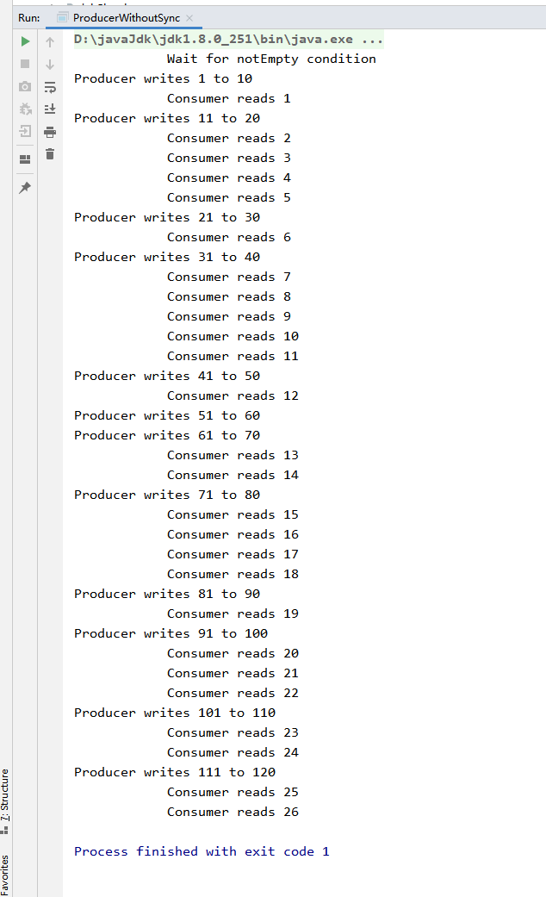
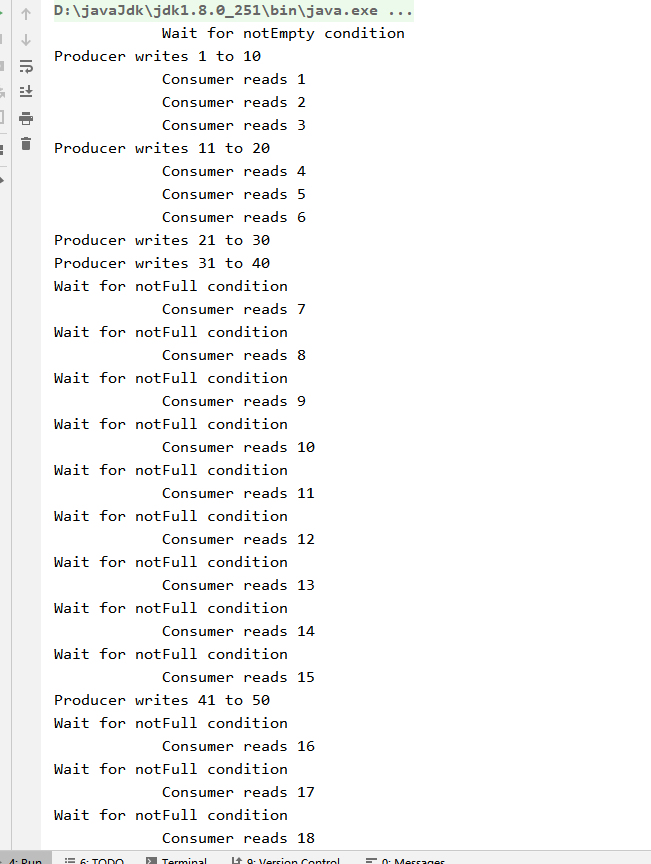

```
ProducerWithoutSync
```



Wait for notEmpty condition
Producer writes 1 to 10
			Consumer reads 1
Producer writes 11 to 20
			Consumer reads 2
			Consumer reads 3
			Consumer reads 4
			Consumer reads 5
Producer writes 21 to 30
			Consumer reads 6
Producer writes 31 to 40
			Consumer reads 7
			Consumer reads 8
			Consumer reads 9
			Consumer reads 10
			Consumer reads 11
Producer writes 41 to 50
			Consumer reads 12
Producer writes 51 to 60
Producer writes 61 to 70
			Consumer reads 13
			Consumer reads 14
Producer writes 71 to 80
			Consumer reads 15
			Consumer reads 16
			Consumer reads 17
			Consumer reads 18
Producer writes 81 to 90
			Consumer reads 19
Producer writes 91 to 100
			Consumer reads 20
			Consumer reads 21
			Consumer reads 22
Producer writes 101 to 110
			Consumer reads 23
			Consumer reads 24
Producer writes 111 to 120
			Consumer reads 25
			Consumer reads 26


### ConsumerProducer




	Wait for notEmpty condition
Producer writes 1 to 10
			Consumer reads 1
			Consumer reads 2
			Consumer reads 3
Producer writes 11 to 20
			Consumer reads 4
			Consumer reads 5
			Consumer reads 6
Producer writes 21 to 30
Producer writes 31 to 40
Wait for notFull condition
			Consumer reads 7
Wait for notFull condition
			Consumer reads 8
Wait for notFull condition
			Consumer reads 9
Wait for notFull condition
			Consumer reads 10
Wait for notFull condition
			Consumer reads 11
Wait for notFull condition
			Consumer reads 12
Wait for notFull condition
			Consumer reads 13
Wait for notFull condition
			Consumer reads 14
Wait for notFull condition
			Consumer reads 15
Producer writes 41 to 50
Wait for notFull condition
			Consumer reads 16
Wait for notFull condition
			Consumer reads 17
Wait for notFull condition
			Consumer reads 18
Wait for notFull condition
			Consumer reads 19
Wait for notFull condition
			Consumer reads 20
Wait for notFull condition
			Consumer reads 21
Wait for notFull condition
			Consumer reads 22
Wait for notFull condition
			Consumer reads 23
Wait for notFull condition
			Consumer reads 24
Wait for notFull condition
			Consumer reads 25
			Consumer reads 26
			Consumer reads 27
			Consumer reads 28
Producer writes 51 to 60
Wait for notFull condition
			Consumer reads 29
Wait for notFull condition
			Consumer reads 30
Wait for notFull condition
			Consumer reads 31
Wait for notFull condition
			Consumer reads 32
Wait for notFull condition
			Consumer reads 33
Wait for notFull condition
			Consumer reads 34
Wait for notFull condition
			Consumer reads 35
Producer writes 61 to 70
Wait for notFull condition
			Consumer reads 36
Wait for notFull condition
			Consumer reads 37
Wait for notFull condition
			Consumer reads 38
Wait for notFull condition
			Consumer reads 39
Wait for notFull condition
			Consumer reads 40
Wait for notFull condition
			Consumer reads 41
Wait for notFull condition
			Consumer reads 42
Wait for notFull condition
			Consumer reads 43
Wait for notFull condition


```
ProducerWithSync
```


Wait for notEmpty condition
Producer writes 1 to 10
			Consumer reads 1
			Consumer reads 2
			Consumer reads 3
Producer writes 11 to 20
			Consumer reads 4
Producer writes 21 to 30
			Consumer reads 5
			Consumer reads 6
			Consumer reads 7
			Consumer reads 8
			Consumer reads 9
Producer writes 31 to 40
			Consumer reads 10
Producer writes 41 to 50
Producer writes 51 to 60
			Consumer reads 11
			Consumer reads 12
Producer writes 61 to 70
			Consumer reads 13
			Consumer reads 14
Producer writes 71 to 80
			Consumer reads 15
			Consumer reads 16
			Consumer reads 17
			Consumer reads 18
Producer writes 81 to 90
			Consumer reads 19
			Consumer reads 20
			Consumer reads 21
Producer writes 91 to 100
			Consumer reads 22
			Consumer reads 23
			Consumer reads 24
			Consumer reads 25
Producer writes 101 to 110
			Consumer reads 26
			Consumer reads 27
			Consumer reads 28
Producer writes 111 to 120
			Consumer reads 29
			Consumer reads 30
Producer writes 121 to 130
			Consumer reads 31
			Consumer reads 32
Producer writes 131 to 140