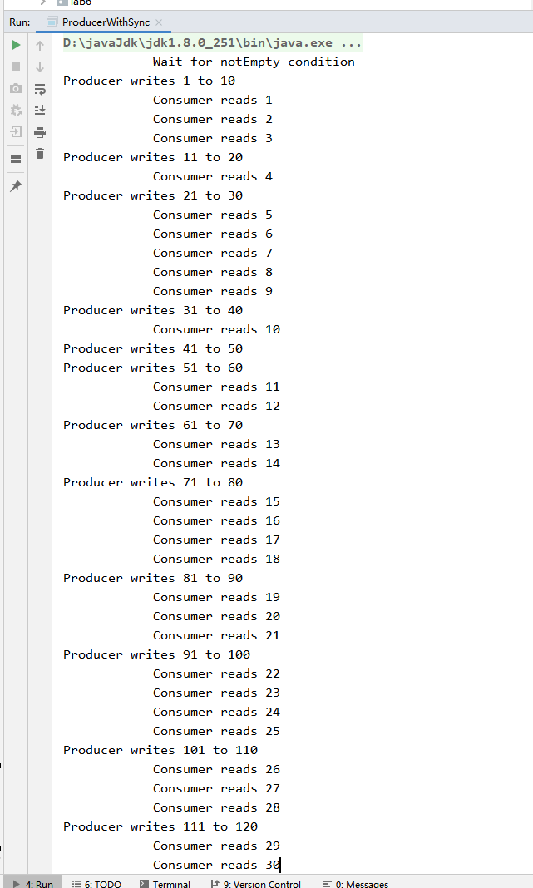

实验十二  多线程高级特性

学号：              姓名：             班级：               
【实验目的和要求】

1.	理解多线程技术；
2.	了解红五游戏的规则。
3.	了解敏捷开发过程
【实验内容】
1、设计一个秒杀模拟程序 ProducerWithoutSync 
1）一种产品
2）一个线程模拟一个固定时间放入若干（比如10）个产品实例
3）若干线程模拟秒杀的此产品的用户
不要使用synchronized机制，观察现象

2、 设计一个秒杀模拟程序 ProducerWithSync 
1）一种产品
2）一个线程模拟一个固定时间放入若干（比如10）个产品实例
3）若干线程模拟秒杀的此产品的用户 
使用synchronized机制，观察现象

输出结果截图：

ProducerWithoutSync


ProducerWithSync



实现代码：

```java
package lab12;

import java.util.concurrent.ExecutorService;
import java.util.concurrent.Executors;
import java.util.concurrent.locks.Condition;
import java.util.concurrent.locks.Lock;
import java.util.concurrent.locks.ReentrantLock;

// ProducerWithoutSync
public class ProducerWithoutSync {
    private static Buffer buffer = new Buffer();

    public static void main(String[] args) {
        // Create a thread pool with two threads
        ExecutorService executor = Executors.newFixedThreadPool(2);
        executor.execute(new ProducerTask());
        executor.execute(new ConsumerTask());
        executor.shutdown();
    }

//    https://www.cnblogs.com/weibanggang/p/9470718.html
    //  ProducerWithoutSync
    // A task for adding an int to the buffer
    private static class ProducerTask implements Runnable {
        public void run() {

            try {
                int i = 1;
                while (true) {

                    int cnt=1;

                    System.out.println(String.format("Producer writes %d to %d", i, i + cnt-1));

                    for (int j = 0; j < cnt; j++) {
                        buffer.write(i++); // Add a value to the buffer
                        // Put the thread into sleep
                    }

//          int scale=10000;
                    int scale = 1000;
//          Thread.sleep((int)(Math.random() * 10000));
                    Thread.sleep((int) (Math.random() * scale));
                }
            } catch (InterruptedException ex) {
                ex.printStackTrace();
            }


        }
    }

    // A task for reading and deleting an int from the buffer
    private static class ConsumerTask implements Runnable {
        public void run() {

            try {
                while (true) {
                    System.out.println("\t\t\tConsumer reads " + buffer.read());

                    int scale = 500;
                    Thread.sleep((int) (Math.random() * scale));

                }
            } catch (InterruptedException ex) {
                ex.printStackTrace();
            }


        }
    }

    // An inner class for buffer
    private static class Buffer {
        //    private static final int CAPACITY = 1; // buffer size
        private static final int CAPACITY = 25; // buffer size
        private java.util.LinkedList<Integer> queue =
                new java.util.LinkedList<Integer>();

        // Create a new lock
        private static Lock lock = new ReentrantLock();

        // Create two conditions
        private static Condition notEmpty = lock.newCondition();
        private static Condition notFull = lock.newCondition();

        public void write(int value) {

            queue.offer(value);

        }

        public int read() throws InterruptedException {


            while (queue.isEmpty()) {
                System.out.println("\t\t\tWait for notEmpty condition");
//          notEmpty.await();
              int scale = 500;
              Thread.sleep((int) (Math.random() * scale));
            }
            int value = 0;
            value = queue.remove();
            return value;

        }
    }
}

```


```java
package lab12;

import java.util.concurrent.ExecutorService;
import java.util.concurrent.Executors;
import java.util.concurrent.locks.Condition;
import java.util.concurrent.locks.Lock;
import java.util.concurrent.locks.ReentrantLock;

// ProducerWithoutSync
public class ProducerWithSync {
    private static Buffer buffer = new Buffer();

    public static void main(String[] args) {
        // Create a thread pool with two threads
        ExecutorService executor = Executors.newFixedThreadPool(2);
        executor.execute(new ProducerTask());
        executor.execute(new ConsumerTask());
        executor.shutdown();
    }

//    https://www.cnblogs.com/weibanggang/p/9470718.html
    //  ProducerWithoutSync
    // A task for adding an int to the buffer
    private static class ProducerTask implements Runnable {
        public void run() {

            synchronized (this){
                try {
                    int i = 1;
                    while (true) {
//          System.out.println("Producer writes " + i);
                        System.out.println(String.format("Producer writes %d to %d", i, i + 9));
                        for (int j = 0; j < 10; j++) {
                            buffer.write(i++); // Add a value to the buffer
                            // Put the thread into sleep
                        }

//          int scale=10000;
                        int scale = 1000;
//          Thread.sleep((int)(Math.random() * 10000));
                        Thread.sleep((int) (Math.random() * scale));
                    }
                } catch (InterruptedException ex) {
                    ex.printStackTrace();
                }
            }

        }
    }

    // A task for reading and deleting an int from the buffer
    private static class ConsumerTask implements Runnable {
        public void run() {

            synchronized (this){
                try {
                    while (true) {
                        System.out.println("\t\t\tConsumer reads " + buffer.read());

                        int scale = 500;
                        Thread.sleep((int) (Math.random() * scale));
//          Thread.sleep((int)(Math.random() * 10000));
                    }
                } catch (InterruptedException ex) {
                    ex.printStackTrace();
                }
            }

        }
    }

    // An inner class for buffer
    private static class Buffer {
        //    private static final int CAPACITY = 1; // buffer size
        private static final int CAPACITY = 25; // buffer size
        private java.util.LinkedList<Integer> queue =
                new java.util.LinkedList<Integer>();

        // Create a new lock
        private static Lock lock = new ReentrantLock();

        // Create two conditions
        private static Condition notEmpty = lock.newCondition();
        private static Condition notFull = lock.newCondition();

        public void write(int value) {
//      lock.lock(); // Acquire the lock

            queue.offer(value);
//
        }

        public int read() throws InterruptedException {


            while (queue.isEmpty()) {
                System.out.println("\t\t\tWait for notEmpty condition");
//          notEmpty.await();
              int scale = 500;
              Thread.sleep((int) (Math.random() * scale));
            }
            int value = 0;
            value = queue.remove();
            return value;


        }
    }
}
```
